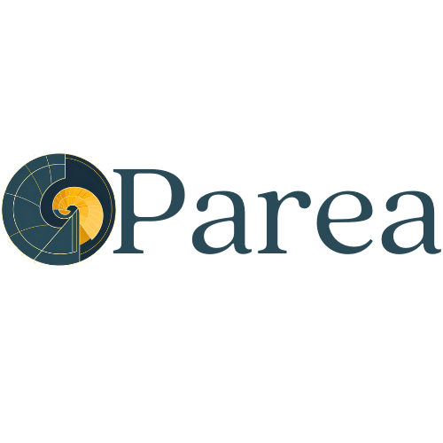

<p align="center">
<a href="https://docs.parea.ai"></a>
</p>

<p align="center">
<b>Test, evaluate & monitor your AI application</b>
</p>

<p align=center>
<a href="https://pypi.org/project/parea-ai/"></a>
<a href="https://pypistats.org/packages/parea-ai"></a>
<a href="https://img.shields.io/github/license/parea-ai/parea-sdk"></a>
</p>

<p align="center">
<a href="https://x.com/PareaAI">🐦 Twitter/X</a>
<span>&nbsp;&nbsp;•&nbsp;&nbsp;</span>
<a href="https://discord.gg/KSEvFRvdue">📢 Discord</a>
<span>&nbsp;&nbsp;•&nbsp;&nbsp;</span>
<a href="https://app.parea.ai/?ref=gh">Parea AI</a>
<span>&nbsp;&nbsp;•&nbsp;&nbsp;</span>
<a href="https://docs.parea.ai">📙 Documentation</a>
</p>


[Parea AI](https://www.parea.ai) provides a SDK to evaluate & monitor your AI applications. Below you can see quickstarts to:

- [evaluate & test](#evaluating-your-llm-app) your LLM App
- [instrument logging & observability](#logging--observability) for your LLM App
- [deploying prompts](#deploying-prompts) to enable collaboration between engineers & subject-matter experts

Our full docs are [here](https://docs.parea.ai/).

## Installation

```bash
pip install -U parea-ai
```

or install with `Poetry`

```bash
poetry add parea-ai
```


## Evaluating Your LLM App

Testing your AI app means to execute it over a dataset and score it with an evaluation function.
This is done in Parea by defining & running experiments.
Below you can see can example of how to test a greeting bot with the Levenshtein distance metric. 

```python
from parea import Parea, trace
from parea.evals.general import levenshtein

p = Parea(api_key="<<PAREA_API_KEY>>")  # replace with Parea AI API key

# use the trace decorator to score the output with the Levenshtein distance  
@trace(eval_funcs=[levenshtein])
def greeting(name: str) -> str:
    return f"Hello {name}"

data = [
    {"name": "Foo", "target": "Hi Foo"},
    {"name": "Bar", "target": "Hello Bar"},
]

p.experiment(
    name="Greeting",
    data=data,
    func=greeting,
).run()
```

In the snippet above, we used the `trace` decorator to capture any inputs & outputs of the function.
This decorator also enables to score the output by executing the `levenshtein` eval in the background.
Then, we defined an experiment via `p.experiment` to evaluate our function (`greeting`) over  a dataset (here a list of dictionaries).
Finally, calling `run` will execute the experiment, and create a report of outputs, scores & traces for any sample of the dataset.
You can find a link to the executed experiment [here](). (todo: fill-in experiment) 


### More Resources

Read more about how to write, run & analyze experiments in our [docs](https://docs.parea.ai/evaluation/overview).


## Logging & Observability

By wrapping the respective clients, you can automatically log all your LLM calls to OpenAI & Anthropic.
Additionally, using the `trace` decorator you can create hierarchical traces of your LLM application to e.g. associate LLM calls with the retrieval step of a RAG pipeline.
You can see the full observability documentation [here](https://docs.parea.ai/observability/overview) and our integrations into LangChain, Instructor, DSPy, LiteLLM & more [here](https://docs.parea.ai/integrations/langchain).

### Automatically log all your OpenAI calls

To automatically log any OpenAI call, you can wrap the OpenAI client with the Parea client using the `wrap_openai_client` method.

```python
from openai import OpenAI
from parea import Parea

client = OpenAI(api_key="OPENAI_API_KEY")

# All you need to do is add these two lines
p = Parea(api_key="PAREA_API_KEY")  # replace with your API key
p.wrap_openai_client(client)

response = client.chat.completions.create(
    model="gpt-4o",
    messages=[
        {
            "role": "user",
            "content": "Write a Hello World program in Python using FastAPI.",
        }
    ],
)
print(response.choices[0].message.content)
```

### Automatically log all your Anthropic calls

To automatically log any Anthropic call, you can wrap the Anthropic client with the Parea client using the `wrap_anthropic_client` method.

```python
import anthropic
from parea import Parea

p = Parea(api_key="PAREA_API_KEY")  # replace with your API key

client = anthropic.Anthropic()
p.wrap_anthropic_client(client)

message = client.messages.create(
    model="claude-3-opus-20240229",
    max_tokens=1024,
    messages=[
        {
            "role": "user",
            "content": "Write a Hello World program in Python using FastAPI.",
        }
    ],
)
print(message.content[0].text)
```

### Nested traces

By using the `trace` decorator, you can create hierarchical traces of your LLM application.

```python
from openai import OpenAI
from parea import Parea, trace

client = OpenAI(api_key="OPENAI_API_KEY")  # replace with your API key

p = Parea(api_key="PAREA_API_KEY")  # replace with your API key
p.wrap_openai_client(client)


# We generally recommend creating a helper function to make LLM API calls.
def llm(messages: list[dict[str, str]]) -> str:
    response = client.chat.completions.create(model="gpt-4o", messages=messages)
    return response.choices[0].message.content


# This will give the Span the name of the function.
# Without the decorator the default name for all LLM call logs is `llm-openai`
@trace
def hello_world(lang: str, framework: str):
    return llm([{"role": "user", "content": f"Write a Hello World program in {lang} using {framework}."}])

@trace
def critique_code(code: str):
    return llm([{"role": "user", "content": f"How can we improve this code: \n {code}"}])

# Our top level function is called chain. By adding the trace decorator here,
# all sub-functions will automatically be logged and associated with this trace.
# Notice, you can also add metadata to the trace, we'll revisit this functionality later.
@trace(metadata={"purpose": "example"}, end_user_identifier="John Doe")
def chain(lang: str, framework: str) -> str:
    return critique_code(hello_world(lang, framework))


print(chain("Python", "FastAPI"))
```

## Deploying Prompts

Deployed prompts enable collaboration with non-engineers such as product managers & subject-matter experts.
Users can iterate, refine & test prompts on Parea's playground.
After tinkering, you can deploy that prompt which means that it is exposed via an API endpoint to integrate it into your application.
Checkout our full docs [here](https://docs.parea.ai/platform/deployment).

```python
from parea import Parea
from parea.schemas.models import Completion, UseDeployedPrompt, CompletionResponse, UseDeployedPromptResponse


p = Parea(api_key="<PAREA_API_KEY>")

# You will find this deployment_id in the Parea dashboard
deployment_id = '<DEPLOYMENT_ID>'

# Assuming your deployed prompt's message is:
# {"role": "user", "content": "Write a hello world program using {{x}} and the {{y}} framework."}
inputs = {"x": "Golang", "y": "Fiber"}

# You can easily unpack a dictionary into an attrs class
test_completion = Completion(
  **{
    "deployment_id": deployment_id,
    "llm_inputs": inputs,
    "metadata": {"purpose": "testing"}
  }
)

# By passing in my inputs, in addition to the raw message with unfilled variables {{x}} and {{y}}, 
# you we will also get the filled-in prompt:
# {"role": "user", "content": "Write a hello world program using Golang and the Fiber framework."}
test_get_prompt = UseDeployedPrompt(deployment_id=deployment_id, llm_inputs=inputs)


def main():
  completion_response: CompletionResponse = p.completion(data=test_completion)
  print(completion_response)
  deployed_prompt: UseDeployedPromptResponse = p.get_prompt(data=test_get_prompt)
  print("\n\n")
  print(deployed_prompt)
```    


## 🛡 License

[](https://github.com/parea-ai/parea-sdk/blob/master/LICENSE)

This project is licensed under the terms of the `Apache Software License 2.0` license.
See [LICENSE](https://github.com/parea-ai/parea-sdk/blob/master/LICENSE) for more details.

## 📃 Citation

```bibtex
@misc{parea-sdk,
  author = {joel-parea-ai,joschkabraun},
  title = {Parea python sdk},
  year = {2023},
  publisher = {GitHub},
  journal = {GitHub repository},
  howpublished = {\url{https://github.com/parea-ai/parea-sdk}}
}
```
